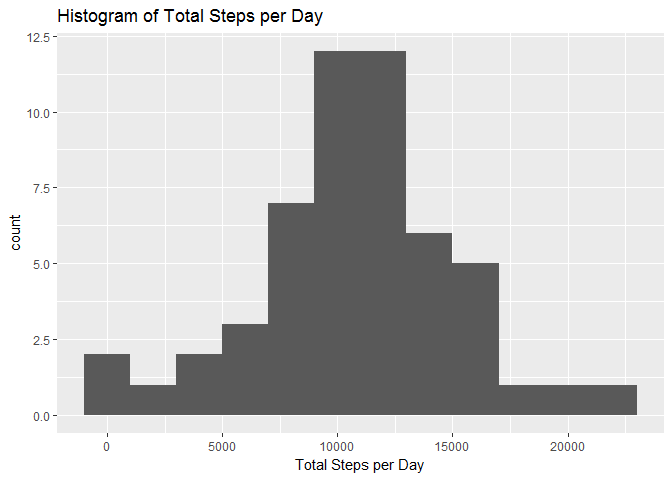
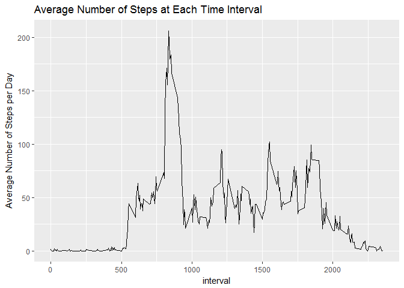
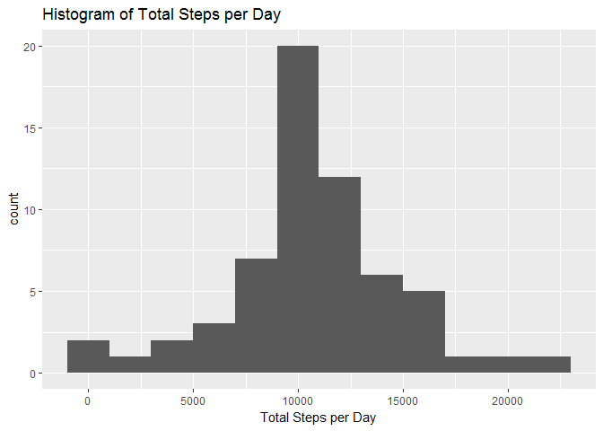
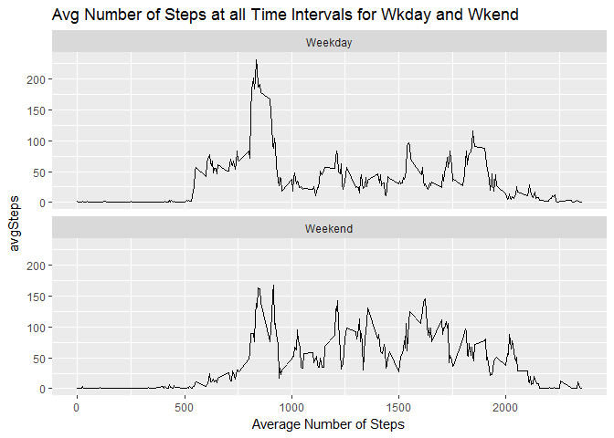

# Reproducible Research Course Project 1
Ryan Angi  
November 30, 2016  


Read in data into R and load required packages: 

```r
library(dplyr); library(ggplot2)
```

```r
df <- read.csv('repdata_data_activity/activity.csv')
```

## 1) Mean total number of steps per day

Calculate the total number of steps per day


```r
s <- df %>% group_by(date) %>% 
        summarize(totalSteps = sum(steps)) %>% 
        na.omit()
print(s)
```

```
## # A tibble: 53 × 2
##          date totalSteps
##        <fctr>      <int>
## 1  2012-10-02        126
## 2  2012-10-03      11352
## 3  2012-10-04      12116
## 4  2012-10-05      13294
## 5  2012-10-06      15420
## 6  2012-10-07      11015
## 7  2012-10-09      12811
## 8  2012-10-10       9900
## 9  2012-10-11      10304
## 10 2012-10-12      17382
## # ... with 43 more rows
```

Next, plot a histogram of the total number of steps per day

```r
ggplot(s, aes(totalSteps)) + geom_histogram(binwidth = 2000) + 
        labs(x = 'Total Steps per Day', title = 'Histogram of Total Steps per Day')
```

<!-- -->

Print the mean and median of the total number of steps taken per day

```r
mn <- mean(s$totalSteps)
med <- median(s$totalSteps)

print(paste('Mean:', mn));print(paste('Median:', med))
```

```
## [1] "Mean: 10766.1886792453"
```

```
## [1] "Median: 10765"
```

## 2) Average Daily Activity Pattern
Set up data for a correct plot


```r
p <- df %>% group_by(interval) %>% 
        na.omit() %>% 
        summarize(avgSteps = mean(steps))
```
Next: plot a time series plot of 5 min intervals and avg number of steps taken


```r
ggplot(p, aes(interval,avgSteps)) + geom_line() + 
        labs(y = 'Average Number of Steps per Day', 
             title = 'Average Number of Steps at Each Time Interval')
```

<!-- -->

Which time interval contains the max number of average steps?


```r
maxint <- p$interval[max(p$avgSteps)]
print(maxint)
```

```
## [1] 1705
```
## 3) Imputing Missing Values
Find total number of rows with NA values. (Total number of TRUE in below table)


```r
table(is.na(df$steps))
```

```
## 
## FALSE  TRUE 
## 15264  2304
```

Fill in NA values with mean for that time interval


```r
impdata <- df %>% 
        group_by(interval) %>% 
        mutate(steps = ifelse(is.na(steps), mean(steps, na.rm = TRUE), steps))
```

Tranform data for histogram of the total number of steps taken each day


```r
impdata1 <- impdata %>% group_by(date) %>% 
        summarize(totalSteps = sum(steps, na.rm = TRUE))


ggplot(impdata1, aes(totalSteps)) + geom_histogram(binwidth = 2000) + 
        labs(x = 'Total Steps per Day', title = 'Histogram of Total Steps per Day')
```

<!-- -->

Print the mean and median of the total number of steps taken per day to see if they have changed from before imputing the data.

```r
mn2 <- mean(impdata1$totalSteps)
med2 <- median(impdata1$totalSteps)

print(paste('Mean:', mn2)); print(paste('Median:', med2))
```

```
## [1] "Mean: 10766.1886792453"
```

```
## [1] "Median: 10766.1886792453"
```

```r
print(paste('Mean same?', ifelse(mn == mn2, 'Yes', 'No')))
```

```
## [1] "Mean same? Yes"
```

```r
print(paste('Median same?', ifelse(med == med2, 'Yes', 'No')))
```

```
## [1] "Median same? No"
```

## 4) Are there differences in activity patterns between weekdays and weekends?

Below we create a panel plot of weekday vs. weekend


```r
wkday <- impdata %>% 
        mutate(weekday = weekdays(as.Date(date))) %>% 
        mutate(weekday = ifelse(weekday == 'Sunday' | weekday == 'Saturday', 'Weekend', 'Weekday')) %>% 
        group_by(weekday,interval) %>% 
        summarize(avgSteps = mean(steps, na.rm = TRUE)) %>% 
        ggplot(aes(interval,avgSteps)) +
                geom_line() +
                facet_wrap(~weekday,nrow = 2) +
                labs(title = 'Avg Number of Steps at all Time Intervals for Wkday and Wkend',
                     x = 'Average Number of Steps')

print(wkday)
```

<!-- -->

        


